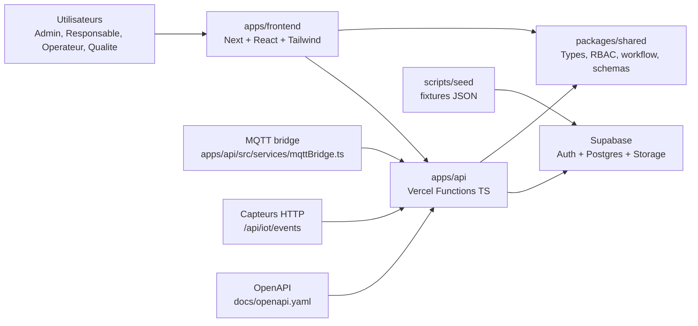
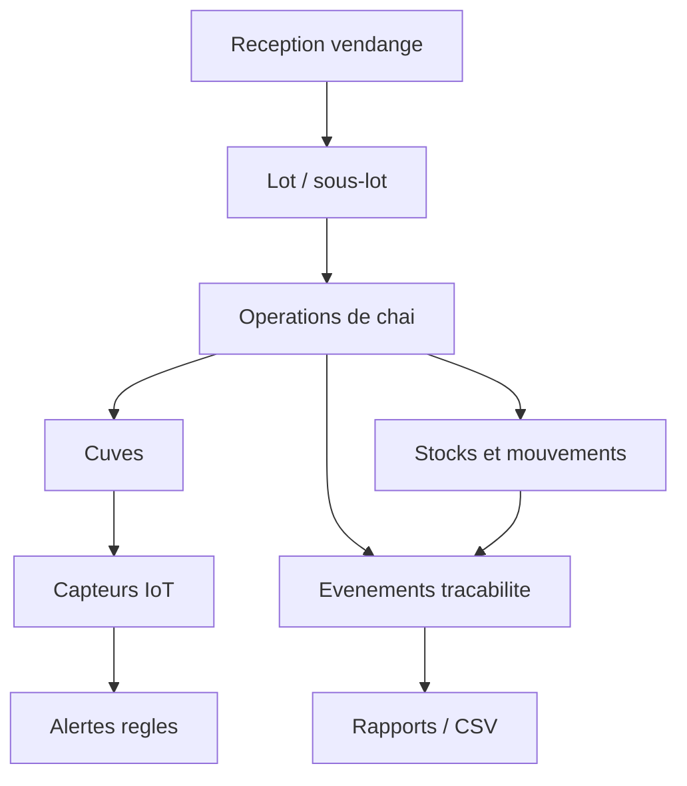

# Architecture

## Decisions

- Le frontend reprend l'organisation de CiderScope: `app`, `components/ui`, `components/views`, `hooks`, `lib`, `types`.
- Les fonctions API restent separees dans `apps/api/api` pour garder un backend serverless Vercel explicite.
- Les regles critiques sont dans `packages/shared` afin d'avoir une source unique pour RBAC, transfert, operations, stocks, alertes, tracabilite, capteurs et export CSV.
- Les donnees sont isolees par `site_id`; l'API filtre les listes par sites autorises et Supabase RLS pose le filet de securite.

## Modules Fonctionnels

